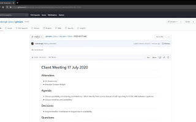

## Integration Branches

A [branch](https://www.educba.com/what-is-git-branch/) is a version of the codebase which is independent of other branches.  Branches start from an existing commit and can be combined with other branches through merging.  Branches are very useful, as they allow multiple developers to work on code at the same time, without having changes from the other causing conflicts with their work in progress.

There are two branches which every project should have: *develop* and *master*.  *develop* is an integration branch; as code is completed, it is merged into this branch, regression tests are run, and any issues integrating code should be corrected.  *master* is the deployment branch; when the code is ready to be released, *develop* is merged into master.  An important thing to note is that *develop* is **not** for working on individual features / issues; the code in this branch should be considered stable and complete, and changes added to this branch only when this condition is met.

Since these branches are common, they should be **protected** - this ensures that code can only enter these branches by pull request, and that the history of these branches cannot be changed through squashing or rebasing.  This can be enforced in your repository settings.

[**Video: Starting a New Sepository**    ](https://drive.google.com/file/d/1QKIMBj8Aewsvp3eHtc3ZxB2BZFQZwoao/view?usp=sharing "Starting a new Repository")

## Pull Requests

Merging to master / develop is always done via [pull requests](https://www.atlassian.com/git/tutorials/making-a-pull-request), which combine many commits / changes into a single, reviewable, atomic change.  The pull request should:
- contain entire deliverable (feature or similar)
- be reviewed by the team
- pass all tests (regression and smoke)
- leave the code in a working, deployable state once merged into develop or master.

[**Video: Reviewing and Merging PRs**    ](https://drive.google.com/file/d/19ooq9qdHZdhOkbxsyYkt1VCXsEQpdRQO/view?usp=sharing "Reviewing and Merging PRs")

## Other Branches

Other branches can be created as needed to complete [issues](./issues.md).  In general, a branch should be created for each feature, which allows full completion of the feature before it is added to develop.  Branches can also be setup for other reasons, such as hotfixes or releases.  Your team can decide how to implement this, but one common process is to follow [git flow](./git_tips.md)

