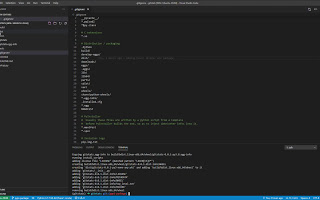
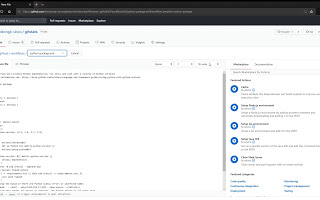
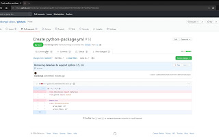

# Project Roles

There are many roles in a software project.  This document defines four [common roles](https://www.dummies.com/careers/project-management/team-roles-within-an-agile-management-framework/) which will be taken on by your team.  Each team member should assume one of these roles for the duration of the project.  A role can be chosen only once, so that each role is represented.  If there are only 3 team members, the responsibilities of the QA lead should be distributed among all members.

## Shared Responsibilities

These responsibilities are for all members of the team.  Each person is expected to:

- All code should be merged into Dev by Reviewed [Pull Request](./git_basics.md) only.  All Pull Requests should reference the issue(s) which it resolves.  A PR can resolve more than one issue, but no issue should take multiple PRs to complete.
- **PR Review** at least one team member who did not work on the issue should review the PR for the following
 - the acceptance criteria are met
 - automated tests are written for the feature
 - automated regression tests are passing
 - code standards are met
 - the project works as expected

## Client Liaison / Product Owner

Your job is to manage all the communication with the client. That means you will keep track of what the client wants, what the client said, hunt down the client if s/he is not responding to your team, document minutes from client meetings, ensure your team is doing what the client wants.  In scrum meetings, you should be the voice of the client and advocate for the issues / success criteria which you believe the client would want.  If you are unsure / unclear, you should communicate with the client until you become sure.

### Responsibilities

- **Weekly Client Meeting** Setup a weekly meeting time to meet in person with the entire team and the client. There may be weeks when your client may need to cancel or meet remotely. But having that regular time slot in place is crucial. This person serves as a single point of contact for the client to ensure consistency and good communication.  If your client says that they don't want to setup a weekly meeting, tell them *I* require one for the course. This day/time must be reported back to me in the case that I need to attend. (In rare situations where things are unpleasant, this can happen).  The entire team should be present to meet with your client.  All of you are expected to contribute.
- **First Client Meeting**  When you meet your client for the first time, introduce yourselves as well as your roles in the project. While your objective is to learn who your client is and the project details, you will need to keep in mind that your client is most likely not familiar with how this course works or what is expected of you or of them. Explain to them there is a course schedule and there are intermediate reports that will be created as part of the project that you will go over with them upon completion.
- **Client Meeting Minutes**  Make sure you document all client meetings as minutes, indicating the attendees, agenda items, discussions made, and a clear set of action items.  These should be committed to your repository.

## Technical Lead / DevOps

Your job is to make sure that the technical requirements are being met.  You are to setup the Git repository with the correct settings for pull requests, code reviews, etc. as well as continuous integration (CI) for stuff like code linting, static analysis, etc.  You are also responsible for ensuring that defined tests are executed, including executing any manual tests or setting up CI to execute automated tests.

### Responsibilities

- **GitHub** All projects will use github. Make sure you each have a github account and your machines are setup to do basic repo pushes, pulls, merges, etc.
- **Git Repository** [Setup the github repository](./git_basics.md).  Some features require a pro github account, which can be obtained using [GitHub for Education](https://education.github.com/pack) and your school e-mail address.  The repository should be configured so that *master* and *develop* branches are only changed through reviewed [pull request](./git_basics.md).  Read the [git tips](./git_tips.md) for some advice on other common Git issues.
- **Development standards** The team will need to decide the coding standards to follow (e.g. spacing/indentation, naming conventions, etc.). These should be enforced in Continuous Integration (CI) through GitHub Actions.
- **Testing** Automated unit testing is required for your project; you are to implement execution of these tests Continuous Integration (CI) through GitHub Actions.
- **Deployable Artifact**  Master should be packaged as a deployable artifact; this ensures that all teammates can view progress and demos can be performed.
- **Integration Help** You are to help others resolve any integration issues that arise, and help with merging PRs if required.

[**Video: Deployable Artifacts**    ](https://drive.google.com/file/d/1JdmV03vOxWLYWSVmAgdGr2e1YN7ff-5e/view?usp=sharing "Video: Deployable Artifacts")

[**Video: Implementing Continuous Integration**    ](https://drive.google.com/file/d/1hlTaBNjvvH14oY4eSOJkMBSWrICa70si/view?usp=sharing "Video: Implementing Continuous Integration")

[**Video: Using Tests to Inform Decisions**    ](https://drive.google.com/file/d/1C96T5vUWZaAG6RtsR0b7yvmoTf-Sd-TF/view?usp=sharing "Video: Using Tests to Inform Decisions")

## Project / Scrum Manager

Your job is to make sure that the project is on track and that the process is being followed by everybody.  In scrum meetings, you should be mainly a facilitator (rather than a technical expert) making sure the process is being followed and all participants have a voice in the proceedings.  Any delays / scope changes should be brought up to the professor early and it is your responsibility to communicate them.

### Responsibilities
- **Weekly Team Meeting**   Projects will work in sprints of 1 week.  All team members should attend this meeting, but not the client.  Issues should be assigned at the start of the sprint with the expectation that they be completed in time for the next sprint.  At the beginning of each sprint, there should be a retrospective on the previous sprint (particularly around tasks completed, timing, and ways to improve the working process) and a planning meeting where tasks are broken down, success criteria assigned, and accepted into the next sprint.
- **Team Meeting Minutes** Make sure you document all weekly meetings, including updating issues and the project board.
- **Facilitating Project Breakdown** Each issue should have approximately the same amount of time estimated to completion.  The entire team should agree on this estimation.  This estimation should be small (2-4 hours), meaning that each issue is isolated and self-contained.  If there is a large feature, it should be made up of many small issues, and the breakdown should continue until the task estimations are in the correct range.  If it is impossible / difficult to estimate an issue, or to produce issues of the correct size, then a research issue should be launched to acquire the knowledge required to better estimate.

## QA Lead

Your job is to define quality standards which your project must meet.  Remember, quality assurance is not quality control (read: [QA is not QC](https://www.diffen.com/difference/Quality_Assurance_vs_Quality_Control)) - you are the champion for your projects standards of quality, and help everyone to meet them.  **IT IS NOT YOUR JOB TO WRITE TO DO WORK FOR OTHERS** - you should not be writing/correcting tests or writing documentation unless you are assigned to that issue.  You can, however, help to identify areas which needed to be better tested, brainstorm ways to test, and help to refine documentation through review.

Responsibilities: 
- **Sprint Planning Oversight** You should make sure that acceptance criteria are specific enough to be actionable and that the validation techniques will prove that the software is functional.
- **Documentation Review** You are also responsible for ensuring that any required documentation is completed.
